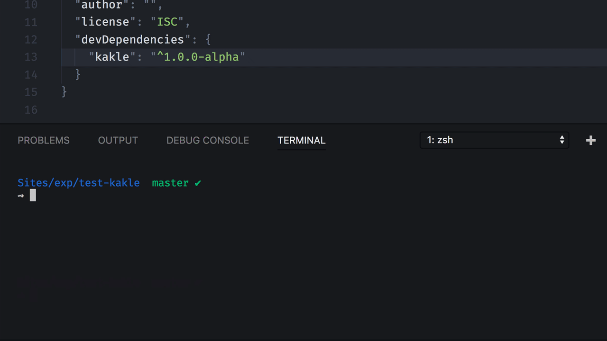

# kakle [](https://www.npmjs.com/package/kakle)



> If Commit Then That

Think of this tool as `If Commit, Then Do`. When working on big or small teams, there comes a time when one of your team members adds a patch that requires you to run a command. For instance adding a dependency to `package.json`, which would require you to know to run `npm install`. `kakle` takes care of that for you based on a shared configuration of criteria and commands for every `pull` or `fetch`.

See more documentation in the [docs](./docs)

## Example Setup

`kakle` uses a local config file (`.kaklerc`) in your repo which you can use to add hooks for commits (this should in most cases be shared on your team). Or you can use the CLI to add interactively:

```shell
⇝ kakle add
? type (tag, regex or glob) glob
? glob package.json
? command npm install
? should run automatically Yes

{
  "glob": "package.json",
  "command": "npm install",
  "autorun": true
}

? Does this look good? Yes
√ Added new hook
```

This adds a `tag hook` to your git messages, and when you merge in or rebase in a new commit with the text `[run]` in the message, the command `curl http://localhost:3000` will automatically run – given that you have activated the kakle hooks. You can check this by doing:

```shell
⇝ kakle hooks status
Hooks not yet activated.
Run `kakle hooks activate` to activate hooks.
```

and activate it by doing:

```
⇝ kakle hooks activate
Activated hooks
```

See other commands by doing `kakle help` or help on a specific topic by doing `kakle help <topic>` (e.g. `kakle help hooks`).

# Usage

```
⇝ kakle -h

Usage: kakle [options] <sub-task>


Commands:

  hooks <command>     activate, deactivate or show current status of git hooks in a repo
  exec <manifest>     execute kakle on manifestfile (mostly used by hooks)
  add [hook-type]     Add tags, regexes and/or globs
  remove [hook-type]  Remove tags, regexes and/or globs
  list [hook-type]    List different tags, regexes and/or globs
  help [cmd]          display help for [cmd]

# Kakle
When working on big or small teams, there comes a time when one of your team
members adds a frontend dependency, adds code that requires database migration,
or just adds a patch that simply requires you to run a command. kakle does
exactly this. If some file is changed, run a command. If a commit message
contains a tag, run a command. If you don't want to automatically run commands,
you can just get a reminder that you should do it your self. kakle can be
summarized as If Commit, Then That.

Options:

  -h, --help     output usage information
  -V, --version  output the version number

```

# Examples

## Adding

```shell
kakle add tag
> tag: <>
> command: <>
> autorun: true|false
```

```shell
kakle add regex
> regex: <>
> command: <>
> autorun: true|false
```

```shell
kakle add glob
> glob: <>
> command: <>
> autorun: true|false
```

## Hooks

```shell
kakle hooks activate
```

```shell
kakle hooks deactivate
```

```shell
kakle hooks status
```

## List

```shell
kakle list
# List all tags/regex/globs
```


## Executing

```shell
kakle exec ./path/to/.kaklerc
```
